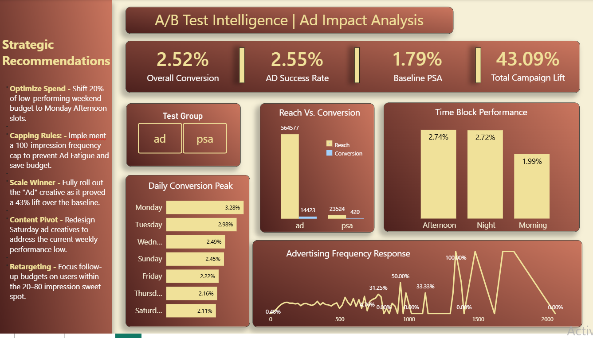

# A/B Testing Analysis | Ad Campaign Conversion & Lift Performance

## Project Technical Documentation
This project analyzes a 500,000+ row advertising dataset to evaluate the impact of display ads against a control group (PSA). The workflow involved heavy data restructuring in Excel followed by advanced measure calculation in Power BI.

##  Data Cleaning - Excel
Before visualization, the raw dataset required specific transformations to enable mathematical analysis:
* **Data Type Normalization:** Converted the `converted` column from Boolean (True/False) to Integer (1/0) using `Find and Replace` to allow for SUM and AVERAGE aggregation.
* **Feature Engineering:** Created the `Time of Day` column by binning hourly data into three segments (Morning, Afternoon, Night) to identify peak conversion windows.
* **Data Binning:** Created `Total Ads (Bins)` using a frequency distribution to group user ad exposure (0-50, 51-100, etc.) for the Saturation Curve.
* **Deduplication:** Removed duplicate `User ID` entries to ensure unique participant tracking across test groups.

##  Calculated Metrics & Formulas
The following logic was implemented within Power BI using DAX to drive the KPI cards and visuals:

### Overall Conversion Rate (CR)
Total Conversions divided by the Total Number of Users.
Formula: `CR = DIVIDE(SUM(Table[converted]), COUNT(Table[user id]))`

### Performance Lift (%)
The percentage difference in conversion probability between the Ad Group and the PSA (Control) Group.
Formula: `Lift = DIVIDE([Ad CR] - [PSA CR], [PSA CR])`
* Result: 43.09% Performance Increase.

### Ad Frequency Response
A longitudinal analysis of `Average Conversion` mapped against `Total Ads (Bins)` to identify the point of diminishing returns.

## Visual Intelligence Summary
* **Conversion by Weekday:** Horizontal analysis identifying Monday as the high-velocity period (3.28% CR).
* **Time-Block Performance:** Comparison of Afternoon vs. Night engagement rates.
* **Ad Frequency Response:** A line chart demonstrating that conversion probability plateaus after 100 impressions, identifying the "Ad Fatigue" threshold.

## Strategic Recommendations
* **Frequency Capping:** Implement a 100-impression limit per user based on the Saturation Curve.
* **Budget Reallocation:** Shift underperforming weekend spend to Monday Afternoon slots.
* **Scale Validation:** Deploy the Ad strategy globally based on the validated 43.1% lift over the baseline.

---

## How to use
1. **Source FILE**                   Download .pbix file [ab_test](ab_test_marketing.pbix)

#### Developer
Maria Aslam
Data Analyst & BI Developer
[LinkedIn](https://www.linkedin.com/in/maria-aslam-458860316/)
